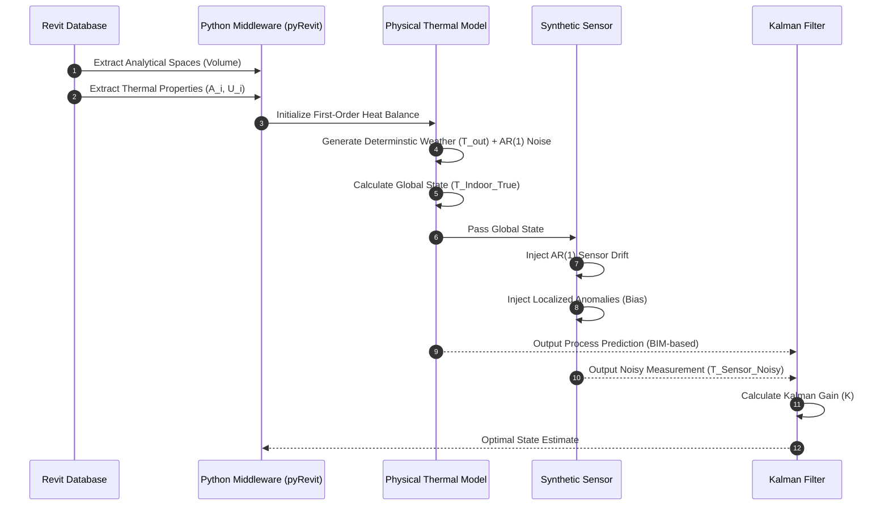

# Temperature Estimation - BIM-Sensor Fusion Data Generator

This repository contains the Python-based BIM-Sensor Fusion tool developed as a technical artifact. It extracts analytical data from Autodesk Revit using the `Autodesk.Revit.DB.Analysis` namespace to execute a first-order heat balance equation. It generates synthetic, noisy sensor data designed for Kalman Filter state estimation.

## How to Run the Code

To execute this tool within Autodesk Revit, follow these steps:

1. **Install Prerequisites:** Ensure you have **Autodesk Revit 2026** and **pyRevit** installed on your system.
2. **Prepare the BIM Model:** Open Revit and load a BIM model. Verify that the model contains properly defined "Rooms".
3. **Create the Tool:** Navigate to the **pyRevit Bundles Creator** tab in the Revit ribbon and create a new **pushbutton** (you can name it anything).
4. **Replace the Script:** Locate the newly created pushbutton folder on your PC. Replace the default generated script with our `script.py` file.
5. **Execute:** Go back to Revit, click your newly created pushbutton to run the script on your BIM model, and it should yield the results.

## 1. Workflow Architecture Diagram
This sequence diagram illustrates the bidirectional data flow between the Revit API, the physical simulation, the synthetic noise processes, and the Kalman Filter.

## 2. Synthetic Data Schema & Simulation Parameters
To ensure full reproducibility of the validation environment, the exact mathematical parameters governing the physics simulation and synthetic noise generation are documented below.

### General Physical Constants
* **Air Density (ρ):** 1.225 kg/m³
* **Specific Heat of Air ($C_p$):** 1006 J/kgK
* **Thermal Mass Multiplier ($\lambda$):** 500x (Simulates thermal inertia of surrounding furniture/interior walls)
* **Time Step (dt):** 60 seconds (1 minute)
* **HVAC Thermostat Logic:** On at <= 20.0°C, Off at >= 22.0°C
* **Heating Output:** 95 W/m³

### Boundary Conditions: Synthetic Weather (T_out)
The external weather profile is a deterministically generated 24-hour sinusoidal wave layered with autoregressive noise.
* **Base Temperature:** -2.0°C
* **Diurnal Amplitude:** 4.0°C
* **Noise Model:** First-order Autoregressive AR(1)
* **AR(1) Smoothing Factor (α):** 0.9
* **Gaussian Variation (σ):** 0.2°C

### Synthetic Sensor Data: Environmental Noise (T_sensor)
The raw synthetic sensor simulates typical thermistor drift distinct from true room state.
* **Noise Model:** First-order Autoregressive AR(1)
* **AR(1) Smoothing Factor (α):** 0.9
* **Gaussian Variation (σ):** 0.13°C

### Localized Sensor Anomalies (Bias Events)
Sensor anomalies are injected deterministically over specific time intervals to represent spatial discrepancies (e.g., proximity to heat sources or drafts). These biases alter the sensor reading without modifying the global physical room state (T_Indoor_True).

* **Event 1: Sudden Heat Load (e.g., Occupancy/Close proximity to radiator)**
  * **Timing:** t=480 (08:00) to t=600 (10:00)
  * **Peak Bias:** +4.0°C reached gradually over 60 minutes, then decaying back to zero over the subsequent 60 minutes.
* **Event 2: Sudden Cooling (e.g., Open window near sensor)**
  * **Timing:** t=780 (13:00) to t=900 (15:00)
  * **Peak Bias:** -6.0°C reached gradually over 60 minutes, then decaying back to zero over the subsequent 60 minutes.

## Mathematical Formulation of the Average Indoor Temperature

The physical ground truth for the Kalman Filter's process model is based on a First Order Lumped Capacitance thermal model. The average indoor temperature ($T_{indoor}$) is governed by the following ordinary differential heat balance equation:

$$ \frac{dT_{indoor}}{dt} = \frac{Q_{gain} - Q_{loss}}{C_{room}} $$

Where the variables and input data are defined as follows:

### 1. Heat Loss ($Q_{loss}$)
The global heat loss is calculated as the sum of transmission losses across all analytical surfaces bordering the outdoor environment.

$$ Q_{loss} = \sum (U_i \cdot A_i) \cdot (T_{indoor} - T_{outdoor}) $$

* **Inputs:** $\sum (U_i \cdot A_i)$ is dynamically extracted from the Revit BIM model. $T_{outdoor}$ is the synthetic AR(1) weather profile.

### 2. Heat Gain ($Q_{gain}$)
The active thermal energy injected into the room by the HVAC system.

$$ Q_{gain} = q_{HVAC} \cdot V \cdot \text{Status} $$

* **Inputs:** $q_{HVAC}$ is a constant normalized heating capacity (95 W/m³). $V$ is the room volume extracted from BIM. $\text{Status}$ is a dynamic binary input (1 or 0) controlled by a thermostat (ON $\le 20^\circ C$, OFF $\ge 22^\circ C$).

### 3. Thermal Mass ($C_{room}$)
The lumped thermal capacitance of the room.

$$ C_{room} = \rho_{air} \cdot C_p \cdot V \cdot \lambda $$

* **Inputs:** Air density ($\rho = 1.225 \text{ kg/m}^3$), specific heat of air ($C_p = 1006 \text{ J/kgK}$), and a $\lambda$ of 500 to simulate the lumped capacitance of the walls and furnishings.

### Discretized State Update
For the computational simulation, this continuous equation is discretized using the Euler integration method with a time-step ($\Delta t$) of 60 seconds:

$$ T_{t+1} = T_t + \left( \frac{Q_{gain, t} - Q_{loss, t}}{C_{room}} \right) \cdot \Delta t $$

This discretized equation forms the exact **Process Model** utilized by the Kalman Filter to balance the physics-based prediction against the sensor measurements.